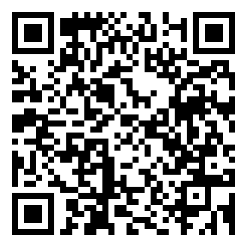

# NSD Bridge (pt-BR)

[English README](README.md)

**Uma ponte sem fio até o cartão SD do seu Nintendo 3DS ou DSi — pelo navegador, pelo terminal, ou por um assistente de IA. Nada hospedado em lugar nenhum: roda inteiramente na sua própria rede Wi-Fi.**


> Controla **hardware real**. Escritas alteram um cartão SD de verdade. Leia o modelo de segurança abaixo antes de habilitá-las.

## Instalar em 30 segundos

**3DS** — precisa do [Luma3DS](https://github.com/LumaTeam/Luma3DS) e do [FBI](https://github.com/Steveice10/FBI) instalados. Abra a FBI → **Remote install via QR code / URL** e escaneie:



Ou baixe o `.cia` / `.3dsx` direto da [última versão](https://github.com/BC-Estrategias/nsd-bridge/releases/latest). Dos dois jeitos, o arquivo sempre corresponde à versão publicada no momento — sem precisar acompanhar número de versão.

**DSi** — precisa do [TWiLight Menu++](https://github.com/DS-Homebrew/TWiLightMenu) instalado no cartão SD. Pegue o `nsd-bridge-dsi-vX.Y.Z.nds` da [última versão](https://github.com/BC-Estrategias/nsd-bridge/releases/latest), copie pra qualquer lugar que o navegador de arquivos do TWiLight Menu++ alcance (a pasta própria `/nsd-bridge`, criada na primeira execução, funciona) e abra por lá. Não existe instalação por QR code pra homebrew de DS; essa é a única cópia manual que você vai precisar fazer — toda atualização depois disso pode ir direto pelo Wi-Fi (veja abaixo).

## Três formas de entrar, um só app no console

```
Navegador ⇄  a página servida pelo próprio console, porta 8080 (NDP sobre WebSocket)   ⇄  ┐
CLI ndev  ⇄  NDP v1 sobre TCP/Wi-Fi                                                    ⇄  ┼  NSD Bridge (app do 3DS ou DSi)
IA        ⇄  MCP (stdio) ⇄ a mesma ponte, no seu computador                           ⇄  ┘
```

### 🌐 A página web — o principal
Abra `http://<ip-do-console>:8080` (o endereço aparece na tela de cima do console) em qualquer navegador da sua rede. Nada pra instalar, nada pra configurar:
- Navegar, ver imagens, editar arquivos de texto (salvamento atômico, backup `.bak` opcional)
- **Arrastar e soltar** pra enviar — arquivos ou pastas inteiras, com SHA-256 conferido e resolução de conflito
- Selecionar, recortar/copiar/colar, "mover para…" / "copiar para…", uma **lixeira** (nada é apagado de verdade sem um segundo passo explícito)
- Ver todo dispositivo pareado com o console — mesmo os que estão offline agora — e remover qualquer um deles direto pela página
- Português e inglês, tema claro/escuro, funciona bem no celular
- **R** no console liga/desliga

### 💻 `ndev` — a linha de comando
`find` · `info` · `ls` · `cat` · `get` · `put` · `mkdir` · `mv` · `cp` · `rm` · `purge` · `pair` · `access`

### 🤖 MCP — para assistentes de IA
Um servidor com 13 ferramentas `nintendo_*` (Claude Code, Codex, …): info do dispositivo, listar/verificar/ler/escrever/criar pasta/mover/apagar, upload/download pra uma pasta local isolada, log do agente. Acha o console sozinho na rede quando o IP muda (DHCP).

## Por que é seguro apontar uma IA pro seu cartão SD
- **Começa em READ_ONLY.** Aperte **X** no console pra liberar escrita. Nenhum comando pela rede muda o modo.
- **Você escolhe as pastas**, fisicamente, no console: **A** → *Access folders* → **Y** alterna fechada → leitura → leitura+escrita. Nada pela rede amplia essa lista.
- **Zonas do sistema nunca aceitam escrita**, mesmo com `/` liberado: no 3DS, `/Nintendo 3DS`, `/luma` (exceto `/luma/plugins` e `/luma/titles`), `/boot.firm`, `/gm9`, `/private`; no DSi, `/_nds` (a pasta do próprio TWiLight Menu++/nds-bootstrap); e, em qualquer um dos dois, a config do próprio agente.
- **Pareamento obrigatório**, comparando um número de 6 dígitos nas duas telas (X25519, ninguém no meio consegue forjar uma coincidência). A chave nunca trafega pela rede. **O servidor MCP não tem ferramenta de pareamento** — um assistente não consegue se parear sozinho.
- **Apagar nunca destrói.** Os itens vão pra uma lixeira primeiro; só uma pessoa pode esvaziá-la. O servidor MCP também não tem ferramenta pra isso.
- O conteúdo de arquivos entregue a um assistente é tratado como **dado não confiável** (as instruções contra prompt injection já vêm nas descrições das ferramentas).
- Tudo fica limitado ao cartão SD. A NAND está fora de escopo, de propósito.

Detalhes completos: [`ARCHITECTURE.md`](ARCHITECTURE.md) §4–5 e [`docs/protocol/ndp-v1.md`](docs/protocol/ndp-v1.md) §4, §11. Problemas de segurança, reporte em privado — veja [`SECURITY.md`](SECURITY.md).

## O que vem por aí: Switch
O núcleo portável (`agent/common`) foi escrito sem depender de plataforma desde o primeiro dia — ele já roda igual no app do 3DS, no app do DSi e no agente de teste de desktop. Adicionar um alvo Switch significa escrever uma camada fina de plataforma (rede, arquivos, UI), não reescrever o projeto.

## Começando (compilando do zero)
Requisitos: um 3DS com Luma3DS e o Homebrew Launcher (ou FBI pra instalar uma CIA), ou um DSi com TWiLight Menu++; Wi-Fi; e Node ≥ 22.18 no computador.

1. **Leve o agente** pro cartão SD: compile (abaixo) ou pegue `nsd-bridge-vX.Y.Z.3dsx` / `.cia` (3DS) ou `nsd-bridge-dsi-vX.Y.Z.nds` (DSi) nas [releases](https://github.com/BC-Estrategias/nsd-bridge/releases/latest).
2. **Abra** no console — ele mostra o IP, o endereço da página e `Mode: READ_ONLY`.
3. **Pareie** (uma vez por computador): aperte **Y** no console, depois
   ```bash
   node bridge/packages/cli/src/main.ts pair <ip-do-console>
   ```
   Aparece um número de 6 dígitos; aperte **A** no console quando ele mostrar o mesmo número (**B** recusa).
3b. **Ou pelo navegador**: abra a página mostrada no console, aperte **Y** no console, clique em **Parear** e aperte **A** quando os números baterem.
4. **Dá uma olhada**: `node bridge/packages/cli/src/main.ts ls <ip-do-console> /3ds/nintendo-dev-agent` (3DS) ou `.../nsd-bridge` (DSi).
5. **Libere mais pastas** no console (**A** → Access folders) e permita escrita (**X**) só quando precisar.
6. **Use por um assistente** — veja [`docs/mcp.md`](docs/mcp.md) pra configurar no Claude Code / Codex.

```bash
./scripts/check.sh --3ds      # vetores, C (-Werror, ASan/UBSan), TypeScript, e o agente 3DS (precisa do devkitPro)
./scripts/build-3ds-cia.sh    # uma .cia com ícone no Menu Home (precisa de third_party/bin/makerom + bannertool)
NDEV_DEV=1 ./scripts/build-3ds.sh   # build de desenvolvimento que já abre com escrita liberada

# DSi (precisa do Wonderful Toolchain / BlocksDS: https://blocksds.skylyrac.net)
export PATH=/opt/wonderful/bin:$PATH BLOCKSDS=/opt/wonderful/thirdparty/blocksds/core
cd agent/dsi && make
```
Depois que um build do DSi estiver pareado e acessível, toda atualização seguinte pode ir direto pelo Wi-Fi: `node bridge/packages/cli/src/main.ts put <ip-do-console> agent/dsi/nsd-bridge-dsi.nds /nsd-bridge/nsd-bridge-dsi-novo.nds` com um nome novo (nunca o arquivo que está rodando no momento), e depois abra ele no console.

Pra testar o protocolo sem console: `./build/agent/host/ndp-host-agent --port 6464 -v --root /tmp/fake-sd` e aponte o `ndev` pra `127.0.0.1:6464`.

## Estrutura do repositório
```
agent/common/   núcleo C99 portável (frames, TLV, paths, política, SHA/HMAC, pareamento, lista de pastas)
agent/posix/    sockets + filesystem compartilhados pelo agente 3DS, pelo agente DSi e pelo agente de teste no host
agent/3ds/      o app do console 3DS (libctru) e a descrição da CIA
agent/dsi/      o app do console DSi (BlocksDS/Wonderful Toolchain)
agent/host/     o mesmo núcleo em macOS/Linux, pros testes
web/            a página que o console serve (JS/CSS puro, sem build tools; scripts/build-web.py embute, gzipado)
bridge/         TypeScript: @ndev/core (codec, cliente, descoberta), @ndev/cli, @ndev/mcp
docs/protocol/  especificação NDP v1 + vetores de teste (gerados por uma implementação Python independente)
docs/research/  medições, achados e os experimentos que não deram certo
spike/          experimentos descartáveis (plugin 3GX, applet do Notas de jogo) — fora do produto
```

## Limitações conhecidas
- O agente é um app em primeiro plano: abrir um jogo o fecha. No 3DS, o Wi-Fi economiza energia quando ocioso, somando ~100–200 ms na primeira ação depois de uma pausa, e criar uma pasta leva ~6 s. No DSi, uma queda de Wi-Fi reconecta sozinha (ou aperte **L** pra escolher a rede na mão); firmware e memória de sistema/app não podem ser reportados (não tem sistema operacional pra perguntar — é homebrew bare-metal).
- A página web é `http://` puro na sua rede local: autenticada (HMAC por frame) mas **não criptografada**, igual à CLI. As transferências rodam na velocidade do Wi-Fi do console — ~0,6–1 MiB/s no 3DS, ~0,15–0,2 MiB/s no DSi — uma de cada vez.
- Não testado em Old 3DS, em Windows com console real, ou com outras configurações de firmware. No DSi, validado no TWiLight Menu++ a partir do cartão SD; o carregador próprio de um flashcart R4i Gold falha ao associar no Wi-Fi (acesso ao SD e escaneamento de rede funcionam) tanto num DSi quanto num DS Lite — não testado em outras marcas de flashcart.

## Licença
[Apache-2.0](LICENSE). Veja [`NOTICE`](NOTICE). Ferramentas de terceiros usadas em builds opcionais (makerom, bannertool, CTRPluginFramework, 3gxtool) são baixadas por você em `third_party/`, que não faz parte deste repositório.
